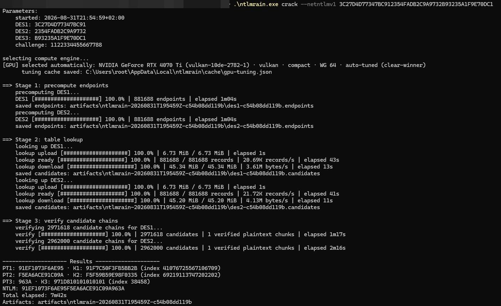

<p align="center">
  
  <h1 align="center">NTLMRain</h1>
</p>

`ntlmrain` is a standalone native command-line client for recovering NT hashes from NetNTLMv1 responses using local WebGPU computation and local/remote table lookup (specific to challenge `1122334455667788`).

It performs endpoint precomputation and candidate verification with WebGPU WGSL shaders and can fallback to a native CPU bitsliced implementation.

Table lookup can use the hosted production HTTP service or local GRTB/GIDX files (downloadable from [tables.ntlmrain.com](https://tables.ntlmrain.com/)).

Refer to the [Outflank Blog - NetNTLMv1 Is Dead. Long Live NetNTLMv1](https://www.outflank.nl/blog/2026/09/08/netntlmv1-is-dead-long-live-netntlmv1/).

## Commands

```text
ntlmrain devices
ntlmrain tune --device auto
ntlmrain crack --netntlmv1 <capture-or-48-hex-response>
ntlmrain crack --des <16-hex-DES-block>
ntlmrain precompute --netntlmv1 <response>
ntlmrain lookup des1-<id>.endpoints
ntlmrain verify --des <16-hex-DES-block> des1-<id>.candidates
```

Use `ntlmrain <command> --help` for further help and additional options.

`ntlmrain crack` runs the three explicit phases:
 * precomputes and saves every endpoint file (local)
 * looks up and saves every candidate file (local or remote) 
 * verifies the saved candidates (local) 

The tooling retains intermediate files under `artifacts/` by default, allowing `lookup` and `verify` to be run/resumed separately later.

Remote submissions may wait in the server queue. The tool shows this after upload and reports `queue position N` whenever the service provides it. Processing rate and ETA begin only after the submission is running.



## Compute selection

Automatic selection allows discrete, integrated, and virtual GPU adapters. We fallback to a CPU implementation if no suitable WebGPU devices are detected.
CPU/software WebGPU adapters such as Microsoft Basic Render Driver remain visible in `ntlmrain devices`, but automatic runs use the native Rust SIMD engine instead. 

Use `--compute webgpu` to deliberately test such an adapter, or `--compute cpu` to force native CPU execution even when a hardware GPU is present.

This tool operates one selected GPU per process. On multi-GPU hosts, use `ntlmrain devices` to list selector IDs and start separate processes when work must be assigned to different adapters.

Automatic tuning uses a 15-second scheduling budget. YMMV. You can always experiment with other shaders and WG sizes by overriding them via command-line arguments. A fully automatic successful tune is cached and reused on the next run.

For the CPU path, `--cpu-threads` controls the fallback worker count; otherwise all available logical CPUs are used. 
For the WebGPU path, manual overrides are available through `--device`, `--backend`, `--shader`, `--workgroup`, and dispatch options. 

## Resuming after interruption

Artifacts are resumable at stage boundaries. Replace the paths and target below
with the paths printed by the interrupted run:

```text
# Start Stage 1
ntlmrain precompute --netntlmv1 <same-response>

# Resume at Stage 2 once both endpoint files exist.
ntlmrain lookup <des1-ID.endpoints> <des2-ID.endpoints>

# Resume at Stage 3 once both candidate files exist.
ntlmrain verify --netntlmv1 <same-response> <des1-ID.candidates> <des2-ID.candidates>
```

For a single DES run, use `--des <same-ciphertext>` and one artifact file.

## Build

Grab the pre-compiled builds from the [releases](https://github.com/outflanknl/ntlmrain/releases).

Building it yourself instead?

```text
cargo build --release
```

The resulting executable is `target/release/ntlmrain` (`ntlmrain.exe` on
Windows). Shader sources and the DES LUT are embedded in the executable.

## Performance

The following empirical measurements cover a complete NetNTLMv1 response: two precompute passes, two table lookups and verification of both candidate sets. The listed totals are the observed complete runtimes, including lookup.

| Compute path | Device and configuration | Precompute | Verify | Total |
|---|---|---:|---:|---:|
| WebGPU | NVIDIA GeForce RTX 4070 Ti, Compact, WG 64 | 1 min × 2 (6.5 G DES steps/s) | ~3 min | 7 min |
| WebGPU | NVIDIA GeForce RTX 2080 SUPER, Compact WG 64 | 3 min x 2 (2.1 G DES steps/s) | ~7 min | 14 min |
| WebGPU | Apple MacBook M1 Pro, Expanded, WG 1024 | 6 min × 2 (1.1 G DES steps/s) | ~10 min | 23 min |
| WebGPU | Intel Core Ultra 9 185H, Intel Arc, Compact, WG 512 | 20 min × 2 | ~20 min | 1 h 1 min |
| CPU | Intel Core Ultra 9 185H, 22 threads | 28 min × 2 | ~46 min | 1 h 43 min |
| CPU | AMD Ryzen 7 7800X3D, 16 threads | 14 min × 2 | ~30 min | 59 min |

They are real-life measurements that can vary. Candidate counts are variable per ciphertext, candidate verification is consequently variable too, and remote lookup can be affected by queue and transfer time. WebGPU performance also depends on the browser, driver and the selected configuration.

## Using local tables

NTLMRain can use the centrally hosted lookup service. However, you can also lookups against locally stored tables.

Download the tables from [tables.ntlmrain.com](https://tables.ntlmrain.com/) into one directory.

Run all three recovery stages using the local table:

```text
ntlmrain crack --netntlmv1 <capture-or-48-hex-response> --lookup local --data-base '/tables/netntlmv1_byte#7-7_0_881689x134217668.grtb' --index '/tables/netntlmv1_byte#7-7_0_881689x134217668.gidx'
```

Note: pass the common GRTB base name (without `.0000`).

On nix, raise the open-file limit before use: `ulimit -n 65536`.

## Responsible use

Don't be evil and don't be annoying. Use the tooling only for authorized work, respect the remote lookup queue and rate limits (one at a time), and do not automate enough parallel requests to monopolize it. Abusive clients will be rate-limited or temporarily blocked so the shared service remains usable for everyone.

## License and acknowledgements

Created by Cedric Van Bockhaven at Outflank (Fortra).

This work builds on a long line of research and implementation:

- **Nic Losby** led the effort to create and publish the NetNTLMv1 tables, documented in the January 2026 [Google/Mandiant release post](https://cloud.google.com/blog/topics/threat-intelligence/net-ntlmv1-deprecation-rainbow-tables/). Without that multi-year effort there would be no dataset to convert or use.
- **Joe Testa** created [RainbowCrackalack](https://github.com/jtesta/rainbowcrackalack), whose table algorithms and specialized NetNTLMv1 work informed the clients and our independent compatibility tests.
- **David Hulton** built and operated the FPGA-backed DES cracking infrastructure. **Moxie Marlinspike** developed ChapCrack; together they presented the practical MS-CHAPv2 reduction and DES service at DEF CON 20. Hulton later documented the [crack.sh service and API](https://media.ccc.de/v/SHA2017-320-legacy_crypto_never_dies).
- **Skyler Knecht** documented the modern table workflow in the recent [SpecterOps article](https://specterops.io/blog/2026/04/16/into-the-rainbow-googles-ntlmv1-rainbow-tables-explained-in-a-bit-too-much-detail/).
- **Philippe Oechslin** introduced rainbow tables as the time-memory trade-off on which this work ultimately relies.

In particular thanks to:

- **Dirk-jan Mollema** for testing the clients and helping squash a steady supply of bugs.
- All the people who tolerated me shouting about rainbow tables out of nowhere from time to time.

The client was built using AI. The code is licensed under the Apache License, Version 2.0; see LICENSE.

The shader implementation was inspired on the NetNTLMv1 kernel by Nic Losby in the forked [RainbowCrackalack](https://github.com/blurbdust/rainbowcrackalack) version. The CPU DES implementation is based on [fast-des](https://github.com/TimTrademark/fast-des) by TimTrademark.

Third-party notices and license texts are in THIRD_PARTY_NOTICES.txt.
